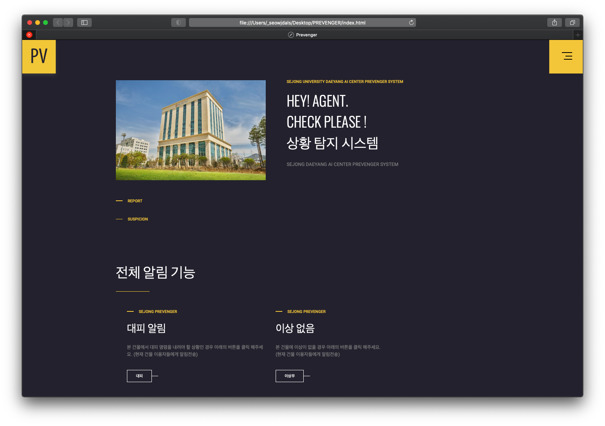

# PREVENGER
> AI 실시간 상황 탐지 시스템 (Front-end)

세종대학교 제 6회 AI 인공지능 해커톤 대회에서 개발한 프로젝트입니다.

개발 포지션은 Front-end로, 첫 프론트 작업 프로젝트였습니다. 

아깝게 본선에는 진출하지 못했지만 프론트 개발을 입문 할 수 있는 좋은 기회였습니다.

<p></p>

## Usage example

index.html을 기준으로 elements.html / projects.html 이 연결이 되어있으며, CSS는 style.css 로 통합하여 사용하였습니다.

## Development - Skill

```sh
HTML5
Javascript
CSS3
JQuery
```

## Meta

🙋🏻‍♂️ Name: 837477 

📧 E-mail: 8374770@gmail.com

📔 Blog: http://837477.pythonanywhere.com

🐱 Github: https://github.com/837477

## Contributing

1. Fork it (<https://github.com/837477/PREVENGER)
2. Create your feature branch (`git checkout -b feature/fooBar`)
3. Commit your changes (`git commit -am 'Add some fooBar'`)
4. Push to the branch (`git push origin feature/fooBar`)
5. Create a new Pull Request
